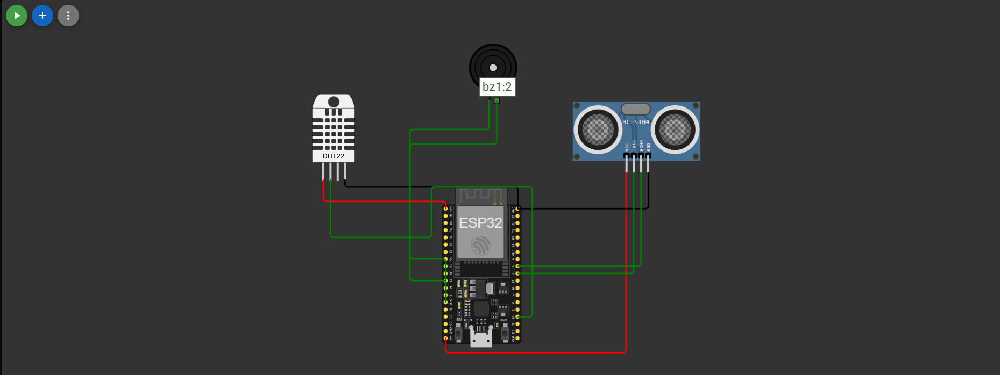

# FIAP - Faculdade de Informática e Administração Paulista

<p align="center">
<a href= "https://www.fiap.com.br/"></a>
</p>

<br>

# FASE 7 - Global Solution - 2º Semestre

## Nome do grupo

## 👨‍🎓 Integrantes:

- Gustavo Valtrick - RM559575
- Iago Cotta - RM559655
- Pedro Scofield - RM560589
- Rodrigo Mastropietro - RM560081
- Tiago de Andrade Bastos - RM560467

## 👩‍🏫 Professores:

### Tutor(a)

- <a href="">Leonardo Ruiz Orabona</a>

### Coordenador(a)

- <a href="https://www.linkedin.com/in/profandregodoi/">André Godoi</a>

## 📜 Descrição

---

# 🌊 Flood Monitor – FIAP GS 2025

**Prever · Monitorar · Alertar**

Prova de conceito (PoC) integrada que:

| Camada | Tecnologias | Função |
|--------|-------------|--------|
| **Borda / IoT** | ESP32 DevKit‑C • HC‑SR04 • DHT‑22 | Mede nível d’água, temperatura e UR (real ou simulado) |
| **Conectividade** | MQTT (`broker.hivemq.com`) | Telemetria JSON em tempo real |
| **Dados & IA** | Python / pandas / scikit‑learn | Random Forest treinado com chuva histórica para prever risco |
| **Interface** | Streamlit | Dashboard ao vivo (métricas + gráfico) |
| **Notificação** | SendGrid SMTP | E‑mail quando o modelo indica **risco = 1** |

---

## 1 · Estrutura do repositório

```text
.
├── arduino/
│   └── FloodDemo_v2.4.ino
├── data/
│   └── dataset_gs.csv
├── python/
│   ├── preprocess_dataset.py
│   ├── train_model.py
│   └── flood_dashboard.py
└── README.md
```

---

## 2 · Teste rápido (modo simulado)

```bash
git clone https://github.com/<seu-usuario>/flood-monitor.git
cd flood-monitor

python -m venv env
# Linux/macOS
source env/bin/activate
# Windows
env\Scripts\activate

pip install (env) pip install pandas paho-mqtt streamlit scikit-learn joblib       # requerimentos

export SENDGRID_KEY="SG.xxxxx"        # PowerShell: $env:SENDGRID_KEY="SG.xxxxx"

python -m streamlit run python/flood_dashboard.py
# abre http://localhost:8501
```

1. No Wokwi (https://wokwi.com/projects/433046881861287937>) abra `arduino/FloodDemo_v2.4.ino` (SIMULATION = `true`).  
2. Clique **Start**.  
3. O painel atualiza; quando **risco = 1** chega e‑mail de alerta.

---
## Desenho do Circuito Completo


## 3 · Hardware real

| Pino ESP32 | Sensor | Descrição |
|-----------:|--------|-----------|
| 5  | HC‑SR04 TRIG | Pulso de disparo |
| 18 | HC‑SR04 ECHO | Pulso de eco |
| 15 | DHT‑22 DATA  | Temp / UR |
| 27 | Buzzer       | Alarme |
| 2  | LED on‑board | Atividade |
| 3V3 / 5V | Vcc     | Alimentação |
| GND | GND         | Referência |

No firmware defina `#define SIMULATION false`, compile e grave.

---

## 4 · Re‑treinar o modelo

```bash
cd python
python preprocess_dataset.py
python train_model.py
```
Gera `risk_model.pkl`; reinicie o Streamlit.

---

## 5 · Variáveis de ambiente principais

| Variável | Uso | Obrigatória |
|----------|-----|-------------|
| `SENDGRID_KEY` | API key SendGrid | ✔ |
| `EMAIL_FROM`   | Remetente verificado (opcional) | |
| `EMAIL_TO`     | Destinatário (opcional) | |
| `MQTT_BROKER`  | Broker MQTT (default HiveMQ) | |

---

## **Dependências diretas do projeto:**
- streamlit
- pandas
- numpy
- paho.mqtt.client
- json
- time
- queue
- logging
- random
- joblib
- os
- smtplib
- email.mime.text
- collections

## 6 · Roteiro do vídeo (≤ 6 min)

1. **Intro (0 :30)** – problema + diagrama.  
2. **Wokwi + Dashboard** – nível sobe ⇒ alerta.  
3. **ML** ativa risco ⇒ e‑mail chega.  
4. Destaque de código.  
5. Encerramento e próximos passos.

## 📁 Estrutura de pastas

Dentre os arquivos e pastas presentes na raiz do projeto, definem-se:

- <b>.github</b>: Nesta pasta ficarão os arquivos de configuração específicos do GitHub que ajudam a gerenciar e automatizar processos no repositório.
- <b>assets</b>: aqui estão os arquivos relacionados a elementos não-estruturados deste repositório, como imagens.
- <b>document</b>: não utilizada nesse projeto
- <b>scripts</b>: não utilizada nesse projeto
- <b>src</b>: Todo o código fonte criado para o desenvolvimento do projeto.
- <b>src/faseX</b>: Pastas que contém o código de cada um dos projetos sendo exibidos em cada uma das páginas do Dashboard.
- <b>src/dashboard</b>: Código do Dashboard. Engloba a página inicial e cada uma das páginas sendo exibidas em arquivos distintos
- <b>README.md</b>: arquivo que serve como guia e explicação geral sobre o projeto (o mesmo que você está lendo agora).

## 🗃 Histórico de lançamentos

- 0.1.0 - 06/06/2025

## 📋 Licença

<p xmlns:cc="http://creativecommons.org/ns#" xmlns:dct="http://purl.org/dc/terms/"><a property="dct:title" rel="cc:attributionURL" href="https://github.com/agodoi/template">MODELO GIT FIAP</a> por <a rel="cc:attributionURL dct:creator" property="cc:attributionName" href="https://fiap.com.br">Fiap</a> está licenciado sobre <a href="http://creativecommons.org/licenses/by/4.0/?ref=chooser-v1" target="_blank" rel="license noopener noreferrer" style="display:inline-block;">Attribution 4.0 International</a>.</p>
